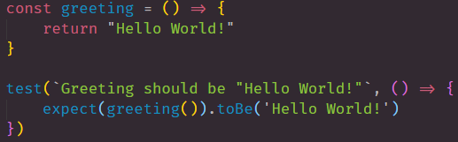
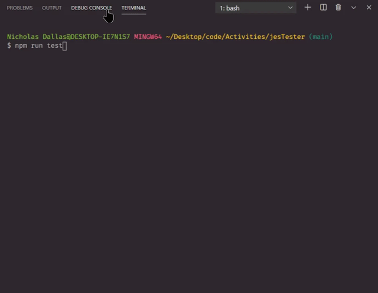
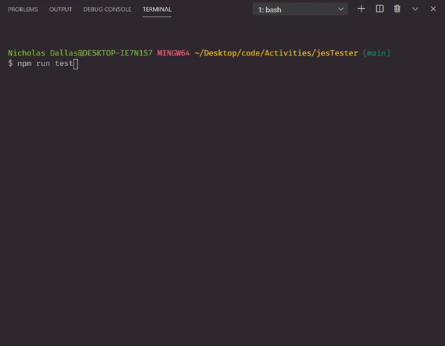
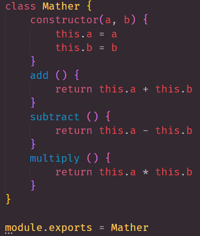
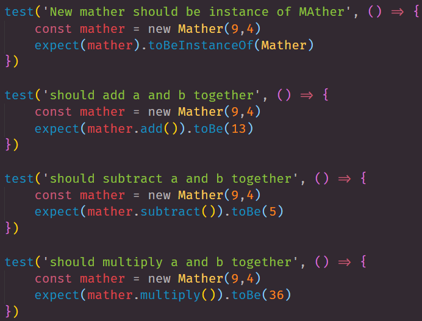
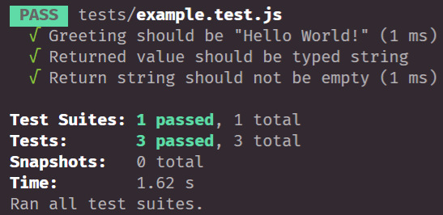

# jesTester

## About 

Using the latest version of Jest and giving examples of how to use Jest. We follow the Jest documents "Getting Started". 

## example.test.js

```
    - We use jest to test our constructors or code
    - when creating a test file you must use .test.js
    - ex) "filename.test.js"
    - You must then use the jest documentation 

```
> when testing files you must follow the documentation as shown below:



### Passing or Failing 

***Passed Test***



***Failed Test***



## Mather.test.js

***Constructor***

> we first make Mather.js a Constructor



***Passing Multiply Parameters***

> we then code each test parameter



***Passed Test***



## Reference Source 

- [NPM](https://www.npmjs.com/)
- [jest](https://jestjs.io/docs/en/getting-started)
- [NPM jest](https://www.npmjs.com/package/jest)


## LINKS

- [GitHub Repo Link](https://github.com/nicholasd-uci/ASWjesTester)
- [Nicholas Dallas's GitHub](https://github.com/nicholasd-uci)

- - -
© 2020 NPRD, Nicholas Paul Ruiz Dallas